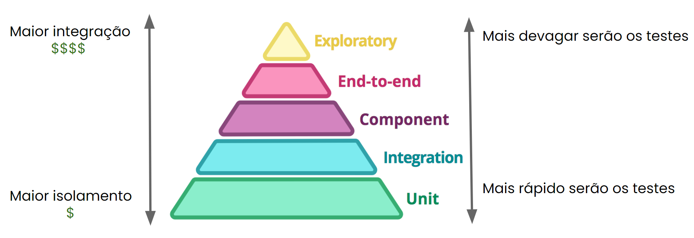
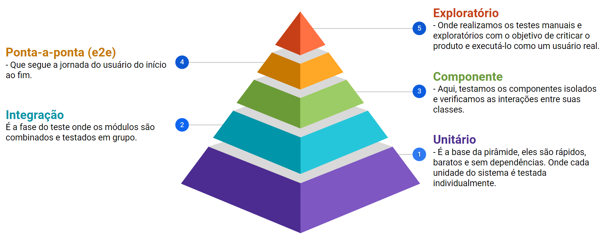
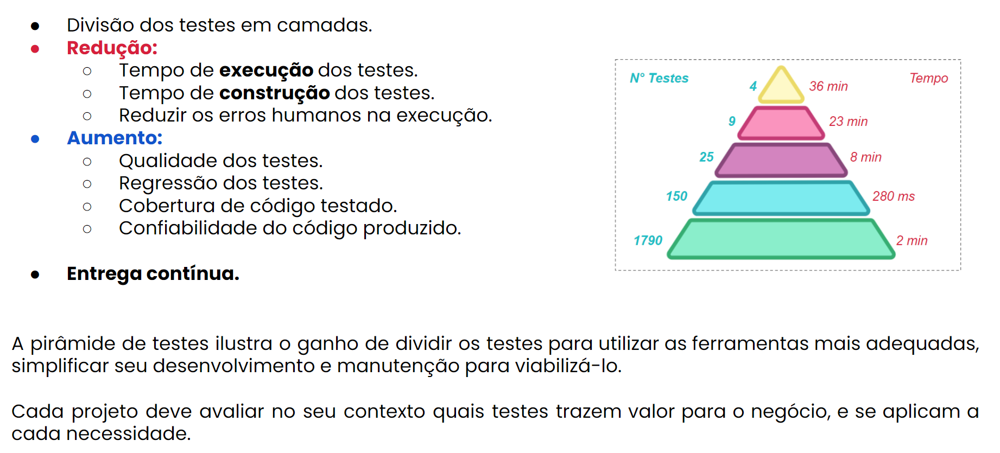

# Técnicas / Estratégias de Testes

## Pirâmide de Testes
A Pirâmide de Testes é uma estratégia visual que nos ajuda a entender como distribuir diferentes tipos de testes no desenvolvimento de software. Imagine uma pirâmide com três níveis:

**Base (Testes Unitários)**: Aqui, temos a maior quantidade de testes. Testamos pequenas partes do código, como funções ou métodos, para garantir que funcionem corretamente. Esses testes são rápidos e baratos de executar.

**Meio (Testes de Integração)**: Nesta camada, testamos a interação entre diferentes módulos ou componentes do sistema para garantir que eles funcionem bem juntos.

**Topo (Testes de Interface do Usuário ou E2E):** No topo da pirâmide, temos a menor quantidade de testes. Esses testes verificam o sistema como um todo, simulando o comportamento do usuário final para garantir que tudo funcione corretamente do início ao fim. Esses testes são mais lentos e caros de executar.

## Quadrante de Testes

O Quadrante de Testes é uma forma de categorizar os diferentes tipos de testes em quatro quadrantes, ajudando a entender seu propósito e foco:

- **Quadrante 1 (Testes Unitários e Componentes):** Foco em verificar a lógica interna e a qualidade do código.
- **Quadrante 2 (Testes Funcionais e Exploratórios):** Foco na validação de funcionalidades e na detecção de problemas de maneira mais intuitiva.
- **Quadrante 3 (Testes de Usabilidade e Exploratórios):** Foco na experiência do usuário e na identificação de problemas a partir da perspectiva do usuário.
- **Quadrante 4 (Testes de Performance e Segurança):** Foco em garantir que o sistema atenda aos requisitos de desempenho e segurança.

## Shift Left Testing

Shift Left Testing é uma abordagem onde os testes são realizados o mais cedo possível no ciclo de desenvolvimento. A ideia é "mover os testes para a esquerda" no cronograma, detectando e corrigindo problemas antes que eles se tornem grandes e caros de resolver. Isso ajuda a melhorar a qualidade do software e a reduzir custos.

## TDD / BDD / ATDD

### TDD (Test-Driven Development)

TDD é uma prática onde os desenvolvedores escrevem testes antes mesmo de escrever o código. O ciclo TDD envolve três etapas: escrever um teste que falhe, escrever código para fazer o teste passar e refatorar o código. Isso garante que o código seja continuamente testado e melhorado.

### BDD (Behavior-Driven Development)

BDD é uma extensão do TDD que envolve a colaboração entre desenvolvedores, QA e stakeholders para definir o comportamento do sistema usando uma linguagem comum. Os cenários são escritos em uma estrutura Given-When-Then (Dado-Quando-Então) e são usados como base para os testes.

### ATDD (Acceptance Test-Driven Development)

ATDD é semelhante ao BDD, mas foca mais nos testes de aceitação. Esses testes são escritos a partir da perspectiva do usuário final e garantem que o sistema atenda aos requisitos do cliente.

## Caixa Preta

Nos testes de Caixa Preta, focamos nas entradas e saídas do sistema sem considerar a lógica interna. Testamos a funcionalidade do sistema como um todo, verificando se ele se comporta conforme esperado.

## Caixa Branca
Nos testes de Caixa Branca, analisamos e testamos a lógica interna do código. Conhecemos a estrutura interna do sistema e verificamos se cada parte do código funciona corretamente.

## Teste baseado em Risco

O Teste baseado em Risco envolve identificar e priorizar áreas do sistema que têm maior probabilidade de falhar ou que têm o maior impacto em caso de falha. Os testes são planejados e executados com foco nessas áreas críticas para garantir que os principais riscos sejam mitigados.

